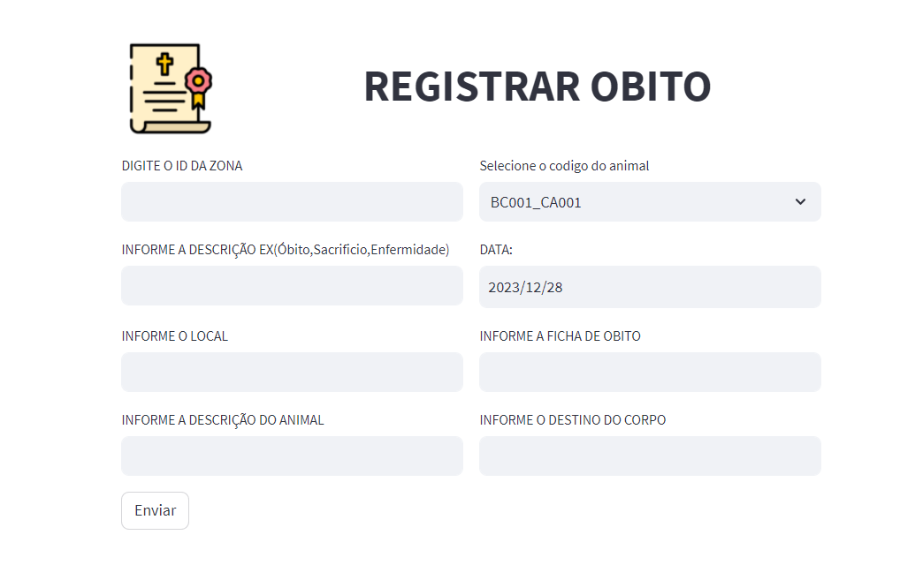
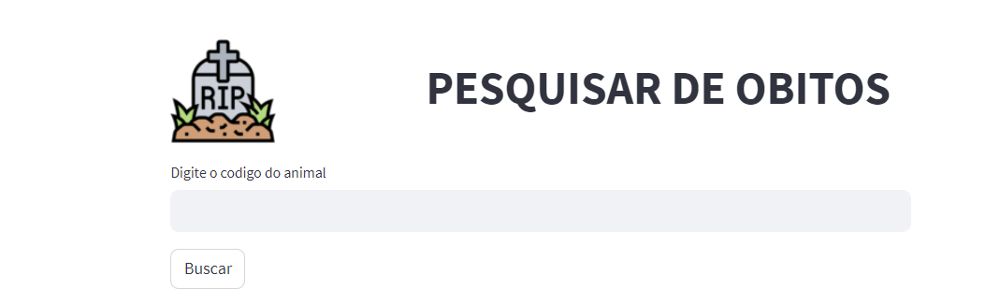
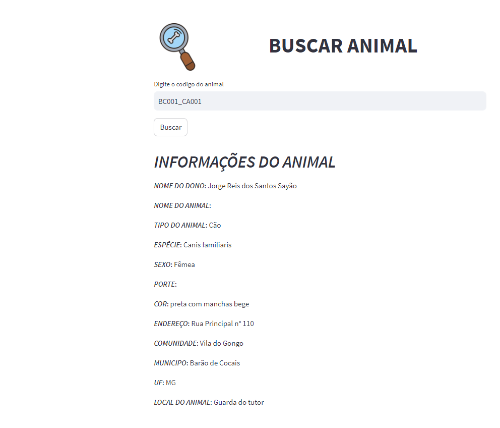

<div align="center">
    <h1>Aplicativo Controle Veterinario</h1>
</div>
<div align="center">    
        
    

</div>

<div align="center">
  <sub>Built with ❤︎</br>
  </sub>
</div>
<br/>

# 🎯 Objective
- Aplicativo para manipulação de animais para veterinarios.
- Modulos permitem adicionar animais , registrar obtitos e consultar os laudos de obitos ao banco de dados.

# :computer: Technologies

This project was made using the follow technologies:

- [Python]
- [Streamlit]
- [MySQL]


### 💻 Run API

```bash
# Go to web folder
$ cd /src
# Install Dependencies
$ pip install requirements.txt
# Run Aplication
$ streamlit run main.py
```

Go to http://localhost:8501/ to see the result.

### 💻 Modulos

<div class="container1">
  <h4>Registrar obtios</h4>
  
</div>

<div class="container2">
  <h4>Pesquisar Registros de Obitos</h4>
  
</div>

<div class="container3">
  <h4>Laudos de Obito</h4>
  
</div>


✒️ <H2>Autores</H2>

Douglas Ribeiro da Silva

🔩 <H2>Considerações</H2> 

Demonstrar a versatilidade da linguagem Python na obtenção e exibição de dados através de Web Scraping 

🎁 <H2>Expressões de gratidão</H2>

Obrigado por visualizar o projeto!

Caso tenha alguma contribuição envie para douglas.ribeiro.dev1@gmail.com


Released in 2022

Give a ⭐️ if this project helped you!
